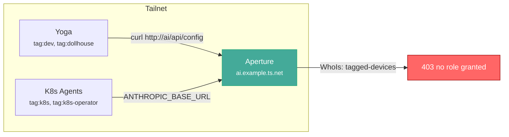
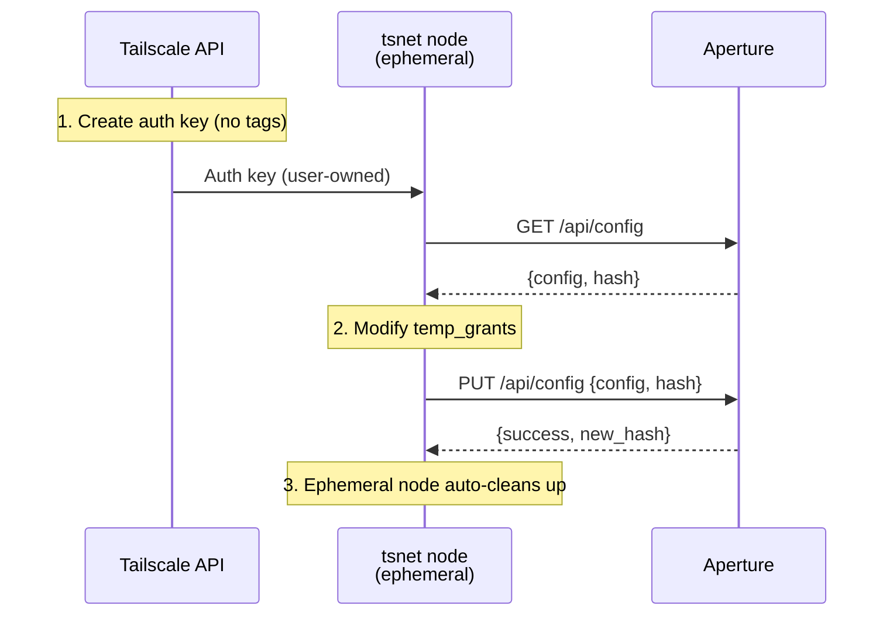
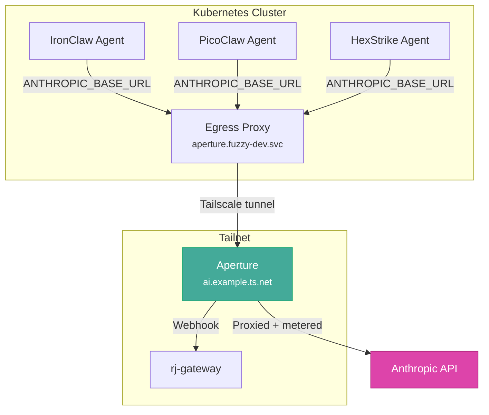

# aperture-bootstrap

Demo Bootstrap [Tailscale Aperture](https://tailscale.com/aperture) config from tagged devices using [tsnet](https://pkg.go.dev/tailscale.com/tsnet).


Aperture uses Tailscale WhoIs to identify who's connecting.  If your devices are **tagged** (as most K8s workloads are), Aperture doesn't recognize the literal string `"tagged-devices"` or tag names like `"tag:dev"` in its `temp_grants` config.  Only explicit user emails and the `"*"` wildcard match.

This creates a chicken-and-egg: you can't access the config API to fix the grants because you don't have a grant.



## The solution

Spin up an **ephemeral, user-owned tsnet node** — no tags, proper user identity.  Aperture's WhoIs sees the real user email, grants access, and you push the config.



After bootstrapping, the network looks like this:



## Quick start

```bash
# Enter dev shell (Go, Dhall, just, jq)
nix develop

# Or install dependencies manually:
#   go 1.22+, just, dhall, dhall-json, jq, curl

# 1. Create an ephemeral auth key
export TS_KEY   # set to your Tailscale management key (tskey-api-...)
export TAILNET      # set to your tailnet name (e.g. example.ts.net)
export TS_AUTHKEY=$(just key)

# 2. Read current config
just read
# Prints JSON to stdout, hash to stderr

# 3. Edit config/default.dhall, then render
just render

# 4. Push the rendered config
just write config/rendered.json <hash-from-step-2>
```

## Full bootstrap (one command)

```bash
export TS_KEY   # set to your Tailscale management key
export TAILNET      # set to your tailnet name
just bootstrap
```

## Config management with Dhall

The `config/` directory uses [Dhall](https://dhall-lang.org) for type-safe config:

- `config/types.dhall` — Aperture config type definitions
- `config/default.dhall` — Your config template (edit this)
- `just render` — Compiles Dhall to `config/rendered.json`
- `just check` — Type-checks without producing output

## Why tsnet?

| Method | Identity seen by Aperture | Works? |
|--------|--------------------------|--------|
| `curl` from tagged device | (empty / tagged-devices) | No |
| SOCKS proxy in container | (empty / tagged-devices) | No |
| `tsnet.Server.HTTPClient()` | `jess@example.com` | Yes |

Aperture's WhoIs only recognizes **user login names** (emails) and the `"*"` wildcard.  Tagged devices don't have a login name — they have tags.  tsnet creates a proper user-owned node whose `HTTPClient()` presents the correct WhoIs identity.

## Blog posts

- [Part 1: Aperture and the tagged-device identity gap](blog/part-1-identity.md)
- [Part 2: Bootstrapping Aperture config with tsnet](blog/part-2-bootstrap.md)

